# Civic साथी - Where Your Voice Meets Actions

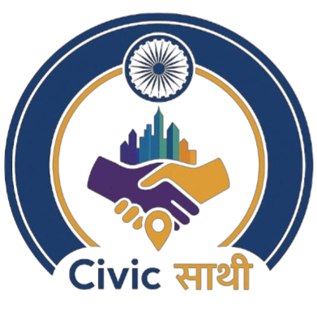

---

## ✨ Civic साथी - Where Your Voice Meets Actions ✨

[](https://github.com/valiantProgrammer/Civic-Issues)

---


**Civic साथी** is a comprehensive civic issues reporting and management platform that empowers citizens to report local infrastructure problems and enables municipal authorities to efficiently manage and resolve these issues. The platform bridges the gap between citizens and local governance, fostering transparency and accountability in civic infrastructure management.

### Tagline
**"Where your voice meets actions"** - Report local issues with just a few taps and help create a better community for everyone.

---

## 🎯 Project Goals

> ✨ **Our Mission** ✨
>
> 1. **Citizen Empowerment** 👥 - Enable citizens to easily report civic issues with multimedia evidence
> 2. **Transparency** 📊 - Provide complete visibility into issue status and action taken
> 3. **Efficient Management** ⚙️ - Help municipal authorities streamline issue verification and resolution
> 4. **Community Building** 🤝 - Foster collaboration between citizens and local government for infrastructure improvement

---

## ✨ Key Features

### For Citizens
- **Easy Report Submission**: Report local issues with photos/videos and detailed descriptions
- **Category Selection**: Choose from predefined issue categories (Pothole, Water Leakage, Street Light, etc.)
- **Location Precision**: Automatic GPS coordinates or manual location picker
- **Media Evidence**: Attach photos or videos as evidence
- **Issue Tracking**: Track the progress of reported issues in real-time
- **Status Updates**: Receive notifications on issue status (Pending, Verified, Approved, Rejected)
- **Issue History**: View all previously reported issues and their resolutions

> ### 🏃 **For Admin (Manual Verification)**
> 
> ✔️ Report Verification | ✅ Approval/Rejection | 📋 Issue Board | 📊 Detailed Analytics

### For Admin (Manual Verification)
- **Report Verification**: Manually verify reported issues as legitimate
- **Approval/Rejection**: Accept verified reports or reject with reasons
- **Issue Board**: Dashboard showing pending, verified, and rejected reports
- **Detailed Analytics**: View statistics on similar issues in the area

> ### 🛠️ **For Administration (Municipal Staff)**
> 
> 📋 Issue Management | 🔄 Status Workflow | 🌍 Municipality Forwarding | 📈 Higher Authority Escalation | 📝 Document History

### For Administration (Municipal Staff)
- **Issue Management**: Assess verified reports and plan resolutions
- **Status Workflow**: Mark issues as approved/rejected or forward to other municipalities
- **Municipality Forwarding**: Send reports to relevant municipal corporation or ward
- **Higher Authority Escalation**: Forward critical issues to state or national authorities
- **Document History**: Complete audit trail of actions taken on each issue

---

## 📱 How to Use

### Step 1: Register & Login
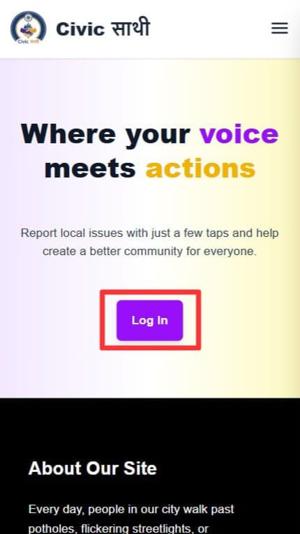
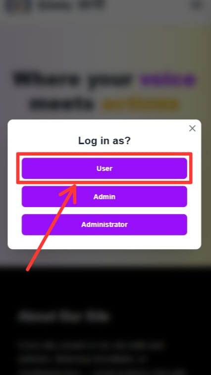

Register as a new user by providing your email, creating a password, and verifying your email through OTP.

### Step 2: Verification & Account Setup
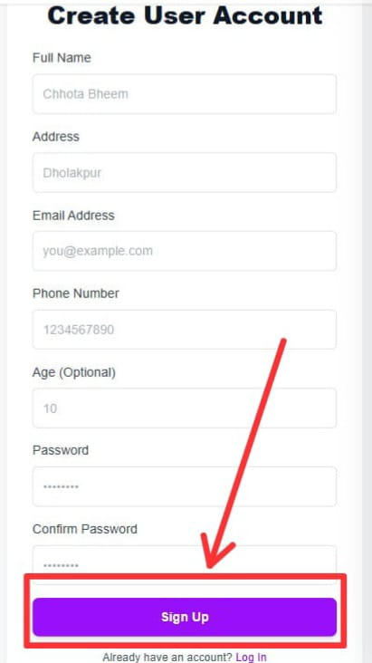
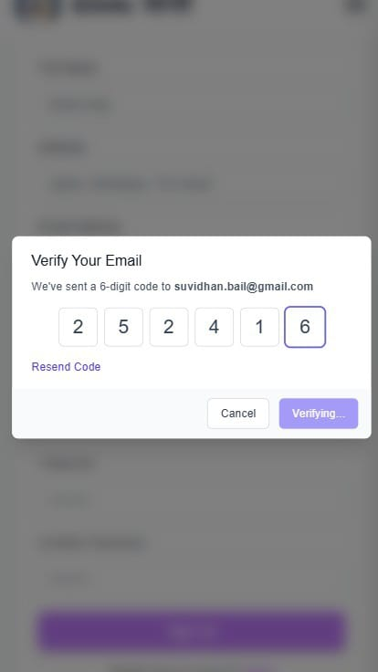

Verify your email address using the OTP sent to your registered email. Once verified, you can log in to your account.

### Step 3: Login to Dashboard
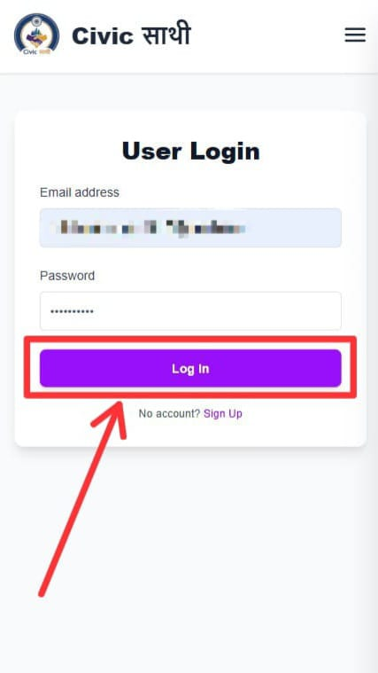

Enter your credentials and click the login button to access your personalized dashboard.

### Step 4: Report an Issue
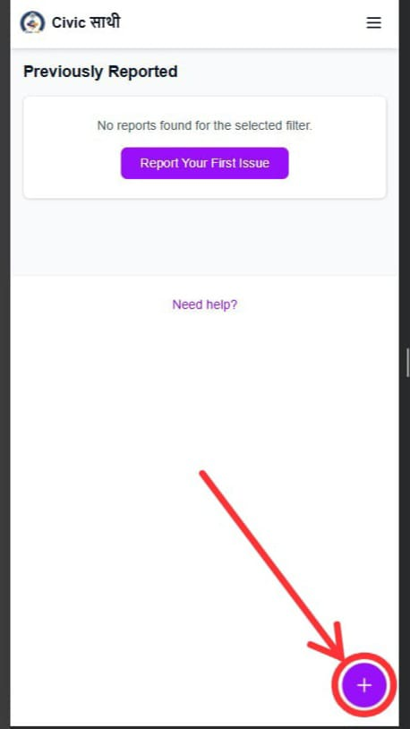
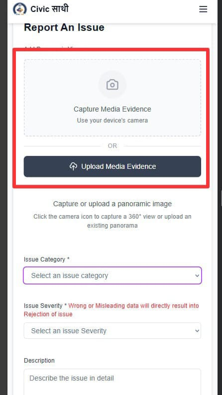

Click on the plus icon (floating action button) to start reporting a new issue. First, add media evidence (photos or videos).

### Step 5: Select Category
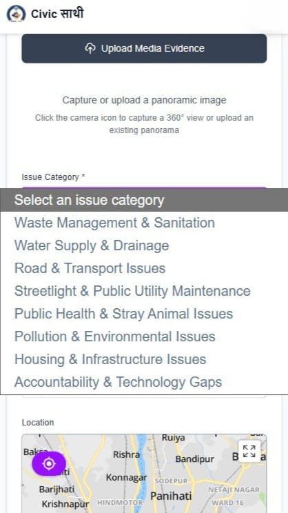

Choose the appropriate category for your reported issue from the available options.

### Step 6: Fill Details & Location
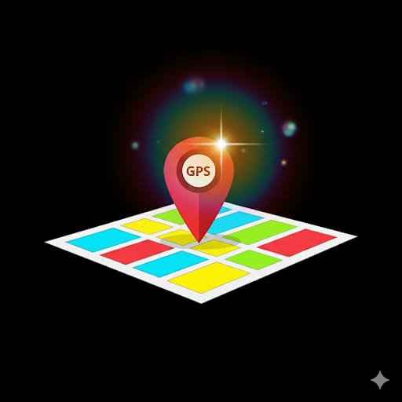


Enter your live coordinates or click the location button to fetch your current location. Fill in the description and other required details, then submit.

### Step 7: Track Progress
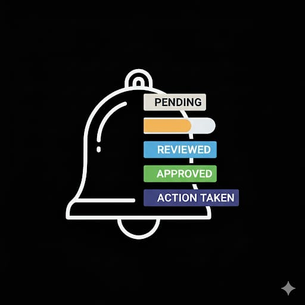

View all your reported issues and track their progress. Click on any issue to see detailed information and status updates.

### Step 8: View Evidence
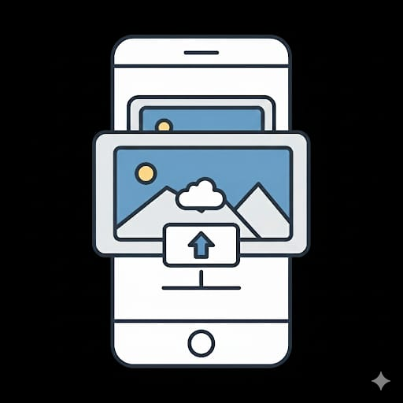

Click on the image or video to view the full media evidence in high quality.

---

## 🛠️ Tech Stack

<div class="animated-block" style="padding: 25px; margin: 20px 0;">
  <h3 style="margin-top: 0; text-align: center;">⚡ Our Technology Arsenal</h3>
</div>


### Backend & Database


### Tools & Libraries


### Development & Deployment


---

## 📊 Architecture Overview

> 🏗️ **System Design & Components**

1. **User Portal**
   - Report submission interface
   - Issue tracking dashboard
   - Profile management

2. **Admin Portal**
   - Manual issue verification
   - Approval/rejection workflow
   - Analytics dashboard

3. **Administration Portal**
   - Issue assessment and resolution
   - Municipality forwarding
   - Higher authority escalation
   - Audit trail

4. **Backend API**
   - Authentication & authorization
   - Report CRUD operations
   - Status management
   - File upload handling
   - Geolocation services

5. **Database**
   - User accounts
   - Report records
   - Status history
   - Municipal data
   - Ward information

---

## 🔄 Issue Workflow

```
┌─────────────────────────────────────────┐
│  CITIZEN REPORT (Pending)               │
│  Report local infrastructure issues     │
└────────────────┬────────────────────────┘
                 │
                 ▼
┌─────────────────────────────────────────┐
│  ADMIN VERIFICATION                     │
│  Manually verify reported issues        │
│  Status: Pending → Verified/Rejected    │
└────────────────┬────────────────────────┘
                 │
                 ▼
┌─────────────────────────────────────────┐
│  ADMINISTRATION ASSESSMENT              │
│  Plan & assign resolution               │
│  Status: Verified → Approved/Rejected   │
└────────────────┬────────────────────────┘
                 │
                 ▼
┌─────────────────────────────────────────┐
│  RESOLUTION & TRACKING                  │
│  Implement and monitor progress         │
│  Status: Approved → Completed/Forwarded │
└─────────────────────────────────────────┘
```

**Status Definitions:**
- **Pending**: Initial report submitted, awaiting admin verification
- **Verified**: Admin has verified the report as legitimate
- **Approved**: Administration has approved and assigned for resolution
- **Rejected**: Issue deemed invalid or duplicate
- **Forwarded**: Issue sent to another municipality or higher authority
- **Completed**: Issue has been resolved

---

## 🚀 Getting Started

> ✨ **Ready to Make an Impact?** ✨
> Follow these simple steps to get started

### Prerequisites
- Node.js (v18 or higher)
- MongoDB (local or Atlas)
- Git
- npm or yarn

> 💡 **Pro Tip:** Make sure you have all prerequisites installed before proceeding!

### Installation

1. **Clone the repository**
```bash
git clone <repository-url>
cd sih
```

2. **Install dependencies**
```bash
npm install
```

3. **Set up environment variables**
Create a `.env.local` file with:
```
NEXT_PUBLIC_API_BASE_URL=http://localhost:3000/api
MONGODB_URI=your_mongodb_connection_string
JWT_SECRET=your_jwt_secret_key
GEMINI_API_KEY=your_gemini_api_key
```

4. **Run development server**
```bash
npm run dev
```

5. **Open in browser**
Navigate to `http://localhost:3000`

---

## 📁 Project Structure

```
sih/
├── app/
│   ├── admin/                 # Admin verification portal
│   ├── administration/         # Municipal staff portal
│   ├── user/                  # Citizen portal
│   ├── api/                   # Backend API routes
│   ├── components/            # Shared components
│   ├── login/                 # Authentication pages
│   ├── signup/                # Registration pages
│   └── layout.js              # Root layout
├── lib/
│   ├── api.js                 # API client functions
│   ├── auth.js                # Authentication utilities
│   └── db.js                  # Database connection
├── models/
│   ├── User.js                # User schema
│   ├── Report.js              # Report schema
│   ├── Admin.js               # Admin schema
│   ├── Administrative.js       # Administration staff schema
│   ├── Municipality.js         # Municipality data
│   ├── Ward.js                # Ward information
│   └── otpUser.js             # OTP verification
├── utils/
│   ├── generateOTP.js         # OTP generation
│   ├── idGenerator.js         # ID generation
│   └── image-processing.js    # Image utilities
├── public/
│   └── images/                # App screenshots & assets
└── package.json               # Dependencies & scripts
```

---

## 🔐 Security Features

> 🛡️ **Protected & Secure**

- **JWT Authentication**: Secure token-based authentication
- **Password Hashing**: Bcrypt for secure password storage
- **OTP Verification**: Email-based two-factor verification
- **Role-Based Access Control**: Separate dashboards for users, admins, and administration staff
- **CORS Protection**: Secure cross-origin requests
- **Input Validation**: Server and client-side validation
- **Image Processing**: Safe image upload and storage

---

## 📈 Key Metrics & Statistics

> 📊 **Track Everything**

The application tracks:
- Total reports submitted
- Reports verified and approved
- Average resolution time
- Popular issue categories
- Municipal-wise statistics
- Ward-wise issue distribution
- Similar reports in the area

---

## 🎓 Features in Detail

### Image & Video Support
- Support for multiple image formats (JPG, PNG, WebP)
- Video upload capability for documentation
- Panoramic image viewer for enhanced visualization
- Automatic image compression and optimization

### Geolocation Services
- GPS coordinate capture
- Interactive map picker
- Ward and municipality auto-detection
- Address reverse geocoding

### AI-Powered Features
- AI-based issue summarization
- Suggested rejection reasons
- Intelligent duplicate detection
- Automated category suggestions

### Real-time Notifications
- Status update alerts
- Verification notifications
- Approval/rejection alerts
- Toast notifications for user actions

---

## 👥 Development Team

> 🌟 **Meet Our Talented Team** 🌟

Developed by the talented team:

- [**RUPAYAN DEY**](https://github.com/valiantProgrammer) - Full Stack Developer & Project Head
- [**RISHIKA MUKHERJEE**](https://github.com/bitsByRishika/) - Frontend Developer & UI/UX Designer
- [**RITAM PAUL**](https://github.com/ritampaul192/) - Backend Developer & Database Architect
- [**SOMMIDHYA BISWAS**](https://github.com/Somiddhya09/) - QA Tester & Admin Page Designer & Documentation Specialist

---

## 📞 Support & Contact

> Have questions or feedback? We'd love to hear from you! Reach out anytime.

For issues, suggestions, or feedback:
- Create an issue in the repository
- Contact the development team
- Report bugs through the application feedback form

---

## 📜 License

This project is open source and available under the MIT License.

---

## 🙏 Acknowledgments

- Special thanks to all users who help improve the platform
- Municipal corporations for their partnership
- The open-source community for amazing libraries and tools
- All supporters and contributors

---

## 🔮 Future Roadmap

> 🚀 **Exciting Features Coming Soon**

- [ ] Mobile app (iOS & Android)
- [ ] Advanced analytics dashboards
- [ ] SMS notifications
- [ ] WhatsApp integration
- [ ] Citizen reputation system
- [ ] Gamification features
- [ ] Blockchain-based verification
- [ ] AI chatbot support
- [ ] Multiple language support
- [ ] Progressive web app (PWA) optimization

---

## 📝 Contributing

We welcome contributions! Please follow these steps:

1. Fork the repository
2. Create a feature branch (`git checkout -b feature/AmazingFeature`)
3. Commit your changes (`git commit -m 'Add some AmazingFeature'`)
4. Push to the branch (`git push origin feature/AmazingFeature`)
5. Open a Pull Request

---

### ❤️ Made with Love for Better Communities ❤️

**Report • Verify • Resolve • Improve**

---

*Created with dedication to civic improvement and community engagement*

**Last Updated: March 2026**
