<div align="center">

<!-- Animated Header Banner -->


<br />

<a href="https://github.com/valiantProgrammer/Civic-Issues">
  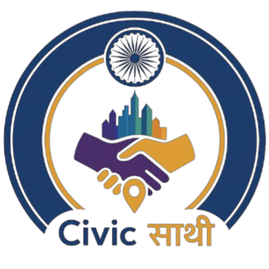
</a>

<p><strong>Empowering Citizens. Streamlining Municipalities. Accelerating Action.</strong></p>

<!-- Typing SVG Value Propositions -->


<br /><br />

<!-- Unified Badges Row -->
[](https://nextjs.org/)
[](https://react.dev/)
[](https://tailwindcss.com/)
[](https://www.mongodb.com/)
[](https://maplibre.org/)
[](./LICENSE)
[](https://github.com/valiantProgrammer/Civic-Issues) <!-- TODO: live demo URL -->
[](https://github.com/valiantProgrammer/Civic-Issues/stargazers)

<br /><br />

<!-- Quick Links Navigation Bar -->
<p>
  <a href="#-current-ui-layouts--walkthrough">Demo</a> &nbsp;|&nbsp;
  <a href="#-key-features">Features</a> &nbsp;|&nbsp;
  <a href="#-current-ui-layouts--walkthrough">Screenshots</a> &nbsp;|&nbsp;
  <a href="#-system-architecture">Architecture</a> &nbsp;|&nbsp;
  <a href="#-municipal-grievance-lifecycle">Lifecycle</a> &nbsp;|&nbsp;
  <a href="#-quick-start">Quick Start</a> &nbsp;|&nbsp;
  <a href="#-api-reference">API</a> &nbsp;|&nbsp;
  <a href="#-development-team">Team</a>
</p>

<!-- Looping Hero Product Preview -->
<a href="#-current-ui-layouts--walkthrough">
  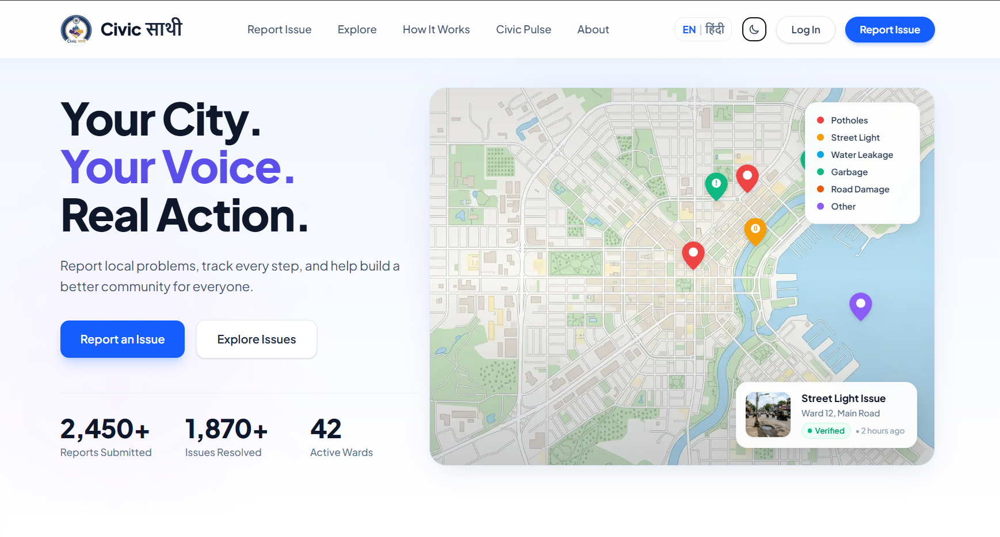
</a>
<sub><em>Figure 1: Citizen portal preview showcasing real-time vector cartography, live issue counters, and community intake.</em></sub>

<!-- TODO: Replace Figure 1 preview image with ./docs/assets/hero-demo.gif once recorded (see Recording Guidance below) -->

</div>

<br />

<br />

## 🌟 About Civic साथी

**Civic साथी** is a full-stack municipal grievance redressal platform engineered to streamline issue reporting, validation, and resolution between citizens and urban local bodies. Modeled after standards from India's **CPGRAMS** and the **Ministry of Housing and Urban Affairs (MoHUA)**, the system connects municipal departments with citizens through geospatial routing, automated SLAs, and audit trails. Live civic pulse analytics and automated AI triage ensure transparent, measurable civic administration without administrative backlogs.

<br />

<table>
  <thead>
    <tr>
      <th width="33.3%">👥 For Citizens</th>
      <th width="33.3%">🛡️ For Ward Admins</th>
      <th width="33.3%">🏛️ For City Leadership</th>
    </tr>
  </thead>
  <tbody>
    <tr>
      <td valign="top">
        • Report issues with auto-detected GPS and ward boundaries.<br />
        • Track progress on a 6-milestone stepper timeline with timestamps.<br />
        • Receive status updates via email and the in-app notification hub.
      </td>
      <td valign="top">
        • Inspect incoming grievances with AI visual triage and duplicate detection.<br />
        • Assign tickets to departmental engineers with target resolution windows.<br />
        • Review uploaded field repair evidence photos before resolution certification.
      </td>
      <td valign="top">
        • Inspect real-time resolution rates, category trends, and ward workloads.<br />
        • Audit SLA compliance (48h target) and prevent supervisor escalations.<br />
        • Access database-computed metrics for empirical resource allocation.
      </td>
    </tr>
  </tbody>
</table>

<br />

<br />

## ⚡ Key Features

<table>
  <tr>
    <td width="50%" valign="top">
      <h4>🗺️ Dual Vector Maps</h4>
      Interactive MapLibre GL maps with day and night vector styles and automated ward polygon detection.
    </td>
    <td width="50%" valign="top">
      <h4>🤖 AI-Assisted Triage</h4>
      MobileNet visual verification and Gemini severity estimation for rapid complaint routing.
    </td>
  </tr>
  <tr>
    <td width="50%" valign="top">
      <h4>⏱️ SLA & Escalation Engine</h4>
      Automated monitoring tracking target resolution hours with supervisor escalation alerts.
    </td>
    <td width="50%" valign="top">
      <h4>🔄 21-Stage State Machine</h4>
      End-to-end lifecycle covering submission, inspection, rework loops, and citizen appeals.
    </td>
  </tr>
  <tr>
    <td width="50%" valign="top">
      <h4>📊 Live Civic Pulse</h4>
      Transparent public dashboard computing resolution velocity and ward distribution directly from MongoDB.
    </td>
    <td width="50%" valign="top">
      <h4>🔒 Role-Based Portals</h4>
      Tailored access control and signed JWT authentication for Citizens, Admins, and Municipal Officers.
    </td>
  </tr>
</table>

<details>
<summary><strong>🔍 Click to expand all platform capabilities and technical feature breakdown</strong></summary>
<br />

- **Geospatial Ward Routing**: Automated polygon intersection (`$geoIntersects` / `$near`) routing complaints directly to assigned ward engineers.
- **Multilingual Intake**: Flexible text and media submission supporting regional languages and voice description inputs.
- **Client-Side Image Verification**: Pre-upload MobileNet inference validating that uploaded images represent genuine civic issues.
- **Automated Duplicate Detection**: Geospatial and textual proximity clustering merging duplicate complaints into a master ticket.
- **Audit Trails**: Immutable event logs recording actor, role, action, and timestamp across every state transition.
- **Transactional Notifications**: Automated email notifications dispatched via Nodemailer for receipt, milestone changes, and resolution notes.
- **Dark & Light Theming**: Bespoke color system with dedicated vector map styles (`ofm_light.json` and `ofm_dark.json`).

</details>

<br />

<br />

## 📸 Current UI Layouts & Walkthrough

### 1. Landing Page & Civic Pulse

Interactive city-wide landing page with dynamic issue counters, followed by the database-driven Civic Pulse analytics engine visualizing resolution curves and ward workloads.

<table>
  <thead>
    <tr>
      <th width="50%">Landing Page & Community Feed</th>
      <th width="50%">Civic Pulse Live Analytics</th>
    </tr>
  </thead>
  <tbody>
    <tr>
      <td valign="top">
        
        <br />
        <details>
          <summary>View Community Issue Feed</summary>
          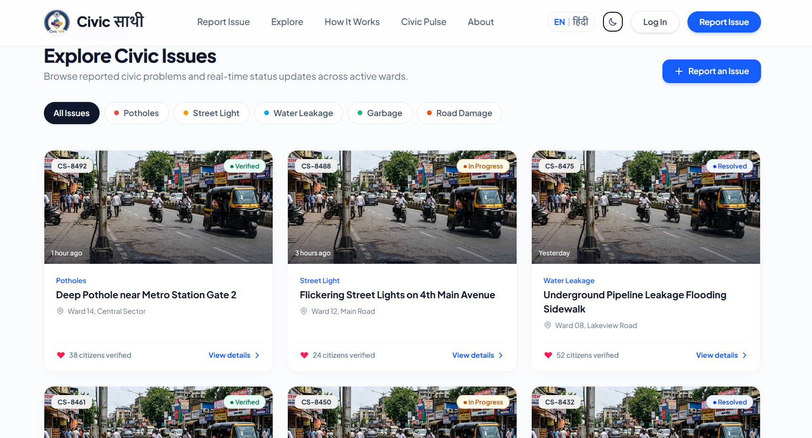
        </details>
      </td>
      <td valign="top">
        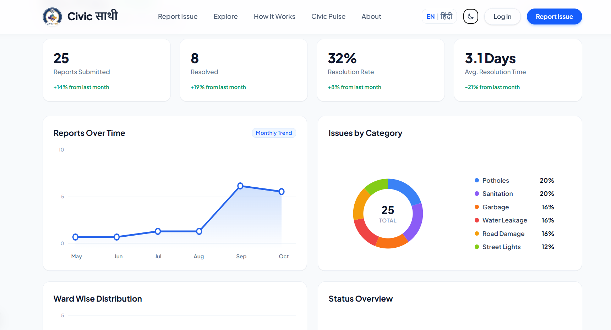
        <br />
        <details>
          <summary>View Ward Distribution & Status Breakdown</summary>
          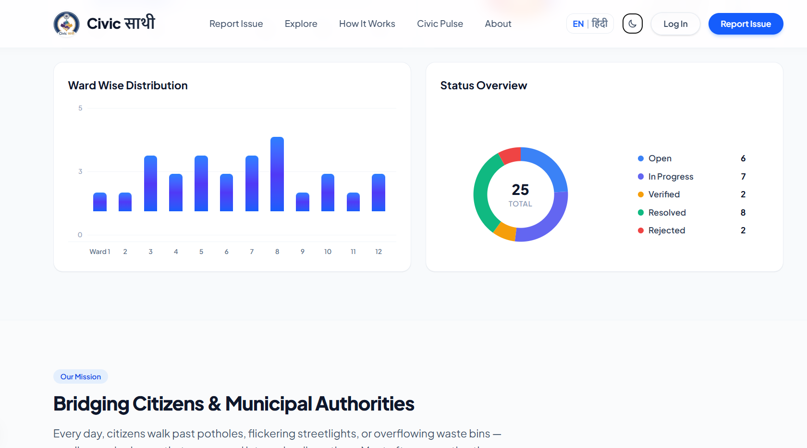
        </details>
      </td>
    </tr>
  </tbody>
</table>
<p align="center"><sub><em>Real-time community reporting overview and database-aggregated civic analytics.</em></sub></p>

---

### 2. Citizen Dashboard

Personalized citizen console displaying registered issues, active status counts, interactive mini-maps, and quick-action shortcuts.

<table>
  <thead>
    <tr>
      <th width="50%">Light Mode</th>
      <th width="50%">Dark Mode</th>
    </tr>
  </thead>
  <tbody>
    <tr>
      <td valign="top">
        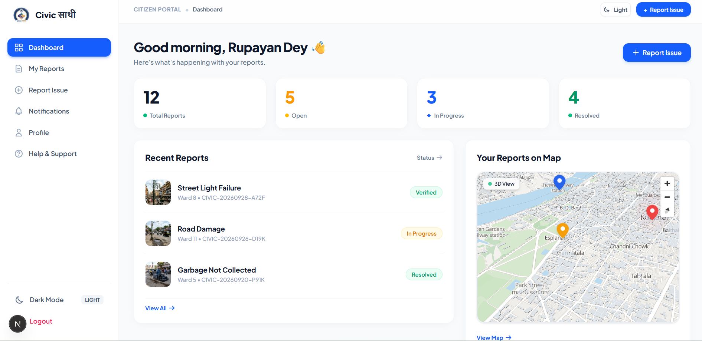
      </td>
      <td valign="top">
        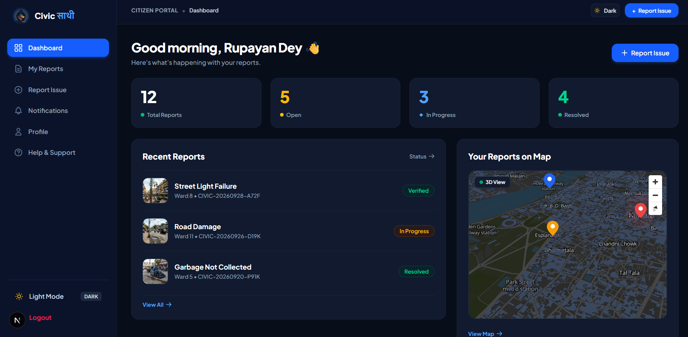
      </td>
    </tr>
  </tbody>
</table>
<p align="center"><sub><em>Citizen portal interface rendered in high-contrast daytime and nighttime themes.</em></sub></p>

---

### 3. Report Submission & Vector Pinning

Multi-step grievance wizard with automatic reverse geocoding, ward boundary intersection, and vector crosshairs for exact coordinates.

<table>
  <thead>
    <tr>
      <th width="50%">Vector Map Pinning (Light Mode)</th>
      <th width="50%">Vector Map Pinning (Dark Mode)</th>
    </tr>
  </thead>
  <tbody>
    <tr>
      <td valign="top">
        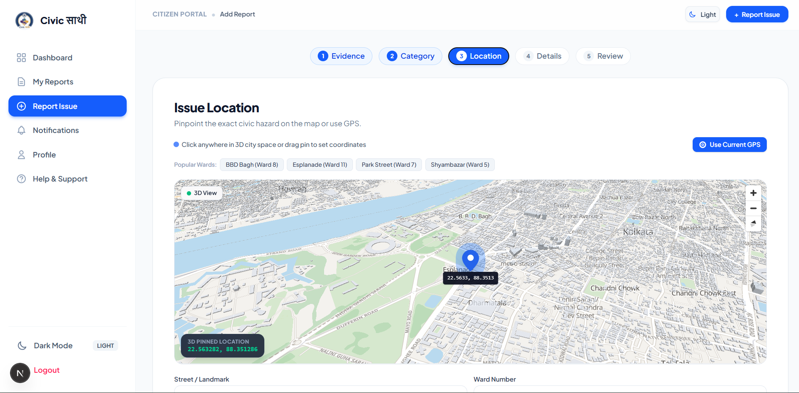
      </td>
      <td valign="top">
        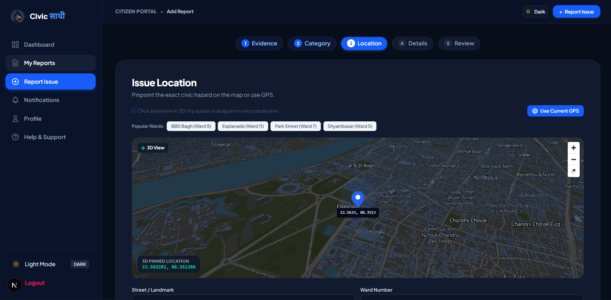
      </td>
    </tr>
  </tbody>
</table>
<p align="center"><sub><em>Step 3 coordinate selection with vector cartography and ward boundary auto-assignment.</em></sub></p>

> [!NOTE]
> **Animated Walkthrough Slot**: Drop `report-flow.gif` into `./docs/assets/` to showcase the full end-to-end reporting intake flow.

---

### 4. Tracking Timeline & Report Detail

Two-column grievance review layout with an active 6-milestone stepper timeline, audit logs, and persistent ticket summary card.

<table>
  <thead>
    <tr>
      <th width="50%">Milestone Tracking (Light Mode)</th>
      <th width="50%">Milestone Tracking (Dark Mode)</th>
    </tr>
  </thead>
  <tbody>
    <tr>
      <td valign="top">
        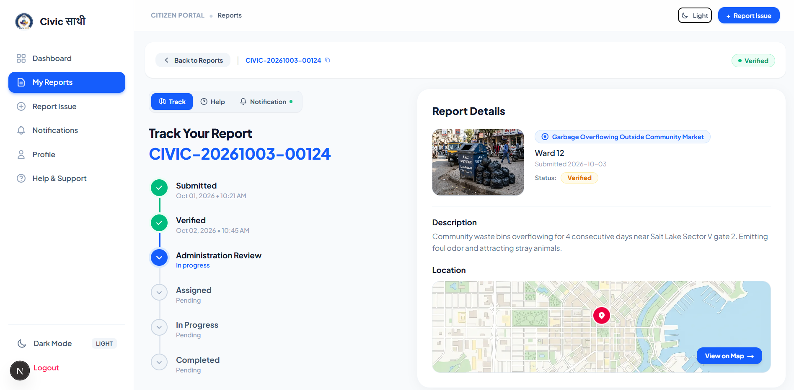
      </td>
      <td valign="top">
        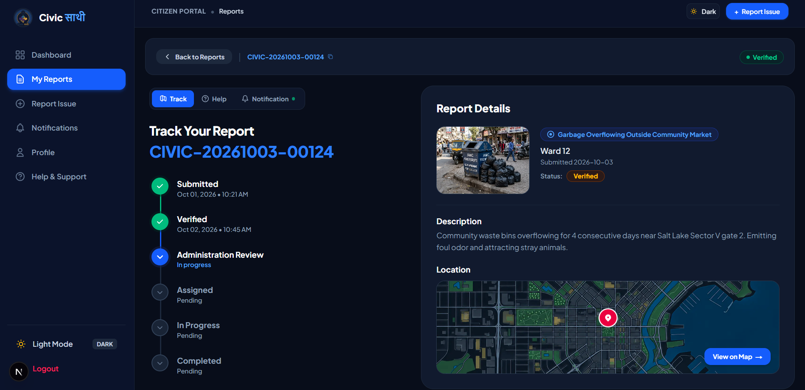
      </td>
    </tr>
  </tbody>
</table>
<p align="center"><sub><em>6-milestone progress stepper (`Submitted ➔ Verified ➔ Admin Review ➔ Assigned ➔ In Progress ➔ Completed`).</em></sub></p>

> [!NOTE]
> **Animated Walkthrough Slot**: Drop `timeline.gif` into `./docs/assets/` to display interactive timeline milestones and audit transitions.

---

### 5. Administration & Municipal Command Center

Role-specific municipal console for Junior Engineers and Review Administrators to triage incoming reports, inspect evidence, audit SLAs, and assign repair teams.

<table>
  <thead>
    <tr>
      <th width="50%">Municipal Command Center</th>
      <th width="50%">Grievance Triage & Verification</th>
    </tr>
  </thead>
  <tbody>
    <tr>
      <td valign="top">
        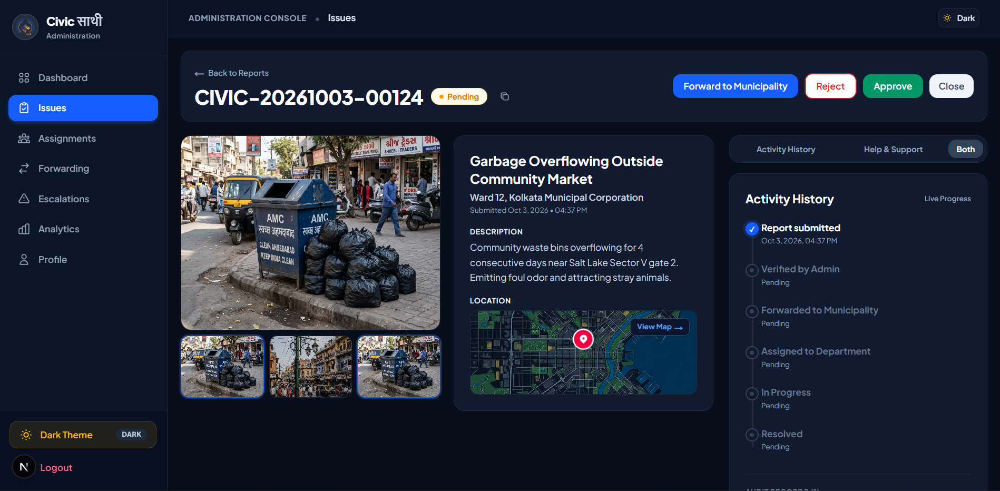
      </td>
      <td valign="top">
        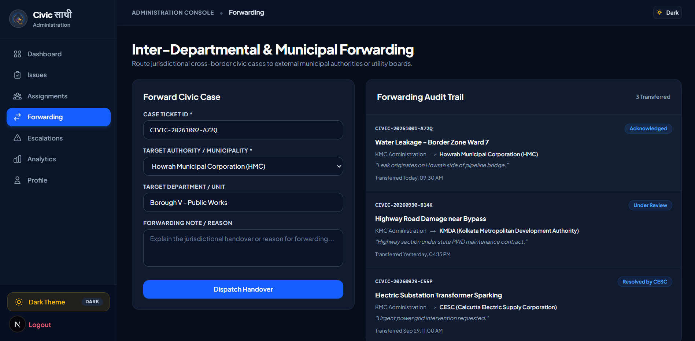
        <br />
        <details>
          <summary>View Verification & Redressal Controls</summary>
          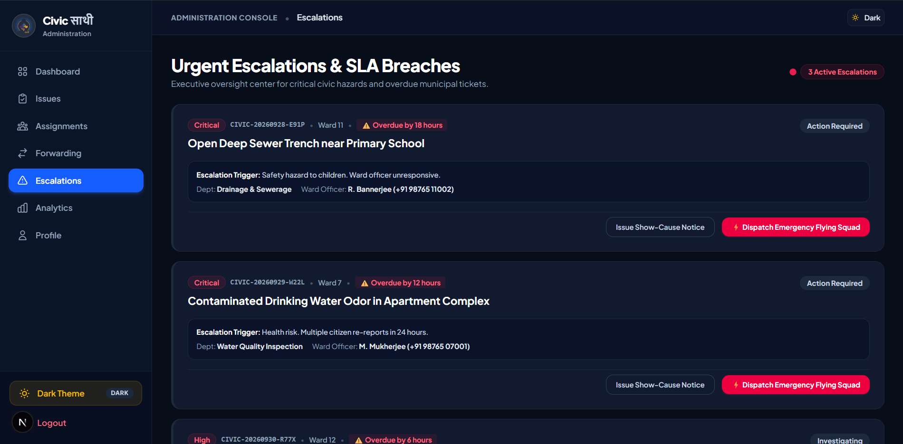
        </details>
      </td>
    </tr>
  </tbody>
</table>
<p align="center"><sub><em>Municipal officer dashboard with triage filters, contractor assignment, and verification controls.</em></sub></p>

<br />

<br />

## 🏗️ System Architecture

<div align="center">
  
  <p><sub><em>Figure 2: Component architecture showing client portals, Next.js serverless engine, AI pipeline, and database tier.</em></sub></p>
</div>

<details>
<summary><strong>📐 Click to view Mermaid architecture flowchart</strong></summary>
<br />

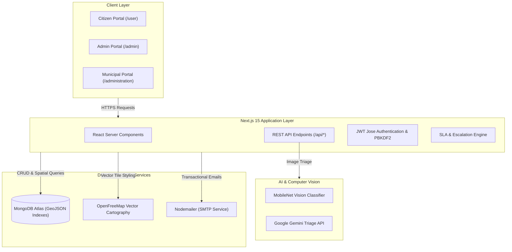
```mermaid
flowchart TD
    subgraph Clients["Client Layer"]
        CP["Citizen Portal (/user)"]
        AP["Admin Portal (/admin)"]
        MP["Municipal Portal (/administration)"]
    end

    subgraph Server["Next.js 15 Application Layer"]
        RSC["React Server Components"]
        API["REST API Endpoints (/api/*)"]
        AUTH["JWT Jose Authentication & PBKDF2"]
        SLA["SLA & Escalation Engine"]
    end

    subgraph AI["AI & Computer Vision"]
        MN["MobileNet Vision Classifier"]
        GEMINI["Google Gemini Triage API"]
    end

    subgraph Services["Data & Messaging Services"]
        MONGO[("MongoDB Atlas (GeoJSON Indexes)")]
        MAPS["OpenFreeMap Vector Cartography"]
        MAIL["Nodemailer (SMTP Service)"]
    end

    Clients -->|HTTPS Requests| Server
    API -->|Image Triage| AI
    Server -->|CRUD & Spatial Queries| MONGO
    Server -->|Vector Tile Styling| MAPS
    Server -->|Transactional Emails| MAIL
```

</details>

<br />

<br />

## 🔄 Municipal Grievance Lifecycle

The grievance state machine implements **21 distinct operational states** divided across seven administrative phases, complete with supervisor quality checks, rework loops, and citizen appeals.

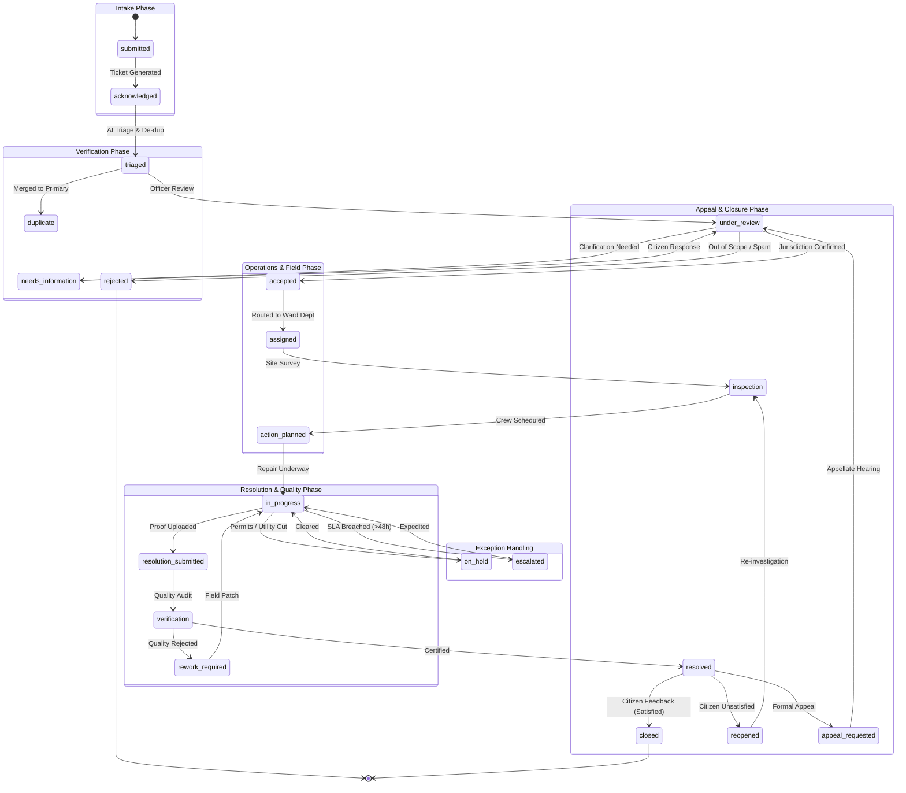
```mermaid
stateDiagram-v2
    direction TB

    state "Intake Phase" as Intake {
        [*] --> submitted
        submitted --> acknowledged : Ticket Generated
        acknowledged --> triaged : AI Triage & De-dup
    }

    state "Verification Phase" as Verification {
        triaged --> under_review : Officer Review
        under_review --> needs_information : Clarification Needed
        needs_information --> under_review : Citizen Response
        under_review --> accepted : Jurisdiction Confirmed
        under_review --> rejected : Out of Scope / Spam
        triaged --> duplicate : Merged to Primary
    }

    state "Operations & Field Phase" as Operations {
        accepted --> assigned : Routed to Ward Dept
        assigned --> inspection : Site Survey
        inspection --> action_planned : Crew Scheduled
        action_planned --> in_progress : Repair Underway
    }

    state "Exception Handling" as Exception {
        in_progress --> on_hold : Permits / Utility Cut
        on_hold --> in_progress : Cleared
        in_progress --> escalated : SLA Breached (>48h)
        escalated --> in_progress : Expedited
    }

    state "Resolution & Quality Phase" as Resolution {
        in_progress --> resolution_submitted : Proof Uploaded
        resolution_submitted --> verification : Quality Audit
        verification --> rework_required : Quality Rejected
        rework_required --> in_progress : Field Patch
        verification --> resolved : Certified
    }

    state "Appeal & Closure Phase" as Closure {
        resolved --> closed : Citizen Feedback (Satisfied)
        resolved --> reopened : Citizen Unsatisfied
        reopened --> inspection : Re-investigation
        resolved --> appeal_requested : Formal Appeal
        appeal_requested --> under_review : Appellate Hearing
    }

    rejected --> [*]
    closed --> [*]
```

<details>
<summary><strong>📋 Click to view complete 21-state definition table and visual diagram</strong></summary>
<br />

<div align="center">
  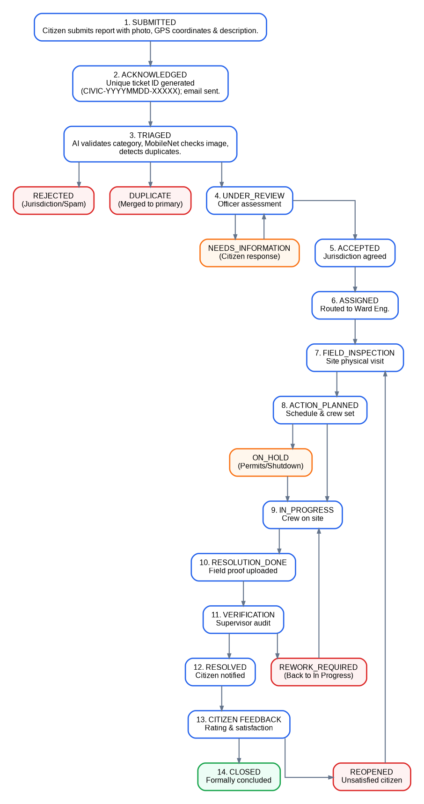
  <p><sub><em>Figure 3: Comprehensive lifecycle state transitions and decision logic.</em></sub></p>
</div>

| # | Status | Phase | Description |
| :-: | :--- | :--- | :--- |
| 1 | `submitted` | Intake | Citizen submits grievance with coordinates, description, and photo. |
| 2 | `acknowledged` | Intake | Ticket ID assigned (`CIVIC-YYYYMMDD-XXXXX`); confirmation sent. |
| 3 | `triaged` | Intake | MobileNet validates image; duplicate detection algorithm scans radius. |
| 4 | `under_review` | Verification | Municipal grievance officer verifies complaint legitimacy and ward boundary. |
| 5 | `needs_information` | Verification | Additional clarification or closer photograph requested from citizen. |
| 6 | `accepted` | Verification | Territory and legal jurisdiction formally accepted by the municipality. |
| 7 | `rejected` | Terminal | Formally rejected with an explicit factual or statutory justification. |
| 8 | `duplicate` | Merge | Linked to existing master ticket; citizen tracks progress of master issue. |
| 9 | `assigned` | Operations | Dispatched to municipal department (Roads, Drainage, Electrical, SWM). |
| 10 | `inspection` | Field | Junior Engineer or Sanitary Inspector conducts physical on-site survey. |
| 11 | `action_planned` | Field | Materials allocated, repair team scheduled, and completion window set. |
| 12 | `in_progress` | Field | Work crew operating on site; machinery deployed. |
| 13 | `on_hold` | Exception | Awaiting traffic clearance, utility shutdown, or weather improvement. |
| 14 | `escalated` | Exception | SLA breached (>48h) or high-hazard ticket escalated to Commissioner. |
| 15 | `resolution_submitted` | Resolution | Field crew completes repairs and uploads after-fix evidence photo. |
| 16 | `verification` | Resolution | Assistant Engineer audits quality of completed field work. |
| 17 | `rework_required` | Loop | Field repair rejected during quality inspection; returned to crew. |
| 18 | `resolved` | Resolution | Work certified as compliant; citizen formally notified. |
| 19 | `reopened` | Appeal | Citizen marks resolution unsatisfied within verification window. |
| 20 | `appeal_requested` | Appeal | Citizen files formal appellate review with the Municipal Secretary. |
| 21 | `closed` | Final | Satisfied citizen feedback received; case formally archived. |

</details>

<br />

<br />

## 💻 Tech Stack

| Domain | Technologies | Rationale |
| :--- | :--- | :--- |
| **Frontend** | [](https://nextjs.org/) [](https://react.dev/) [](https://tailwindcss.com/) | App Router architecture, server-rendered components, and utility-first design tokens. |
| **Backend** | [](https://nodejs.org/) [](https://github.com/panva/jose) [](https://nodemailer.com/) | Scalable serverless API route handlers, stateless signed JWTs, and email dispatch pipeline. |
| **Data & GIS** | [](https://www.mongodb.com/) [](https://mongoosejs.com/) | 2dsphere indexing for GeoJSON polygons, spatial queries, and multi-tenant schema isolation. |
| **Maps** | [](https://maplibre.org/) [](https://openfreemap.org/) | GPU-accelerated client-side vector tile rendering without proprietary API quota limits. |
| **AI & Vision** | [](https://www.tensorflow.org/) [](https://ai.google.dev/) | Client-side visual verification paired with server-side grievance severity analysis. |

<br />

<br />

## 🚀 Quick Start

Follow these steps to set up and run Civic साथी locally.

### 1. Prerequisites

- **Node.js**: `v18.18+` or `v20+` (Next.js 15 requires Node 18.18+)
- **MongoDB**: MongoDB Atlas cluster URI or local MongoDB instance (`v6.0+`)
- **Git**

### 2. Clone & Install Dependencies

```bash
git clone https://github.com/valiantProgrammer/Civic-Issues.git
cd Civic-Issues
npm install
```

### 3. Configure Environment Variables

Create a `.env` file in the project root:

```bash
cp .env.example .env  # or create a new .env file
```

> [!WARNING]
> Never commit your `.env` file to version control. Keep all database connection strings, JWT signing keys, and SMTP application passwords confidential.

<details>
<summary><strong>⚙️ Click to view required environment variables</strong></summary>
<br />

| Variable | Description | Example / Default |
| :--- | :--- | :--- |
| `NEXT_PUBLIC_API_BASE_URL` | Base API URL accessible by the browser | `http://localhost:3000/` |
| `JWT_SECRET` | 32+ character signing key for citizen and admin auth | `your-secure-random-32-char-key` |
| `ACCESS_TOKEN_EXPIRY` | Lifetime of signed session access token | `3d` |
| `REFRESH_TOKEN_EXPIRY` | Lifetime of refresh token | `30d` |
| `MONGODB_URI` | MongoDB Atlas or local connection string | `mongodb+srv://<user>:<pwd>@cluster0.mongodb.net/` |
| `SMTP_USERNAME` | SMTP sender email address | `noreply.civicsaathi@gmail.com` |
| `SMTP_PASSWORD` | SMTP provider application-specific password | `xxxx xxxx xxxx xxxx` |
| `EMAIL_FROM` | Outgoing display name and email address | `Civic Saathi <noreply@civicsaathi.gov.in>` |
| `CLOUDINARY_CLOUD_NAME` | *(Optional)* Cloudinary cloud name for media hosting | `your_cloud_name` |
| `CLOUDINARY_API_KEY` | *(Optional)* Cloudinary API key | `your_api_key` |
| `CLOUDINARY_API_SECRET` | *(Optional)* Cloudinary API secret | `your_api_secret` |
| `GEMINI_API_KEY` | Google Gemini API key for AI grievance triage | `AIzaSy...` |

</details>

### 4. Seed Database with Municipal Data

Populate the database with sample Kolkata Municipal Corporation boundaries, 12 geospatial wards, municipal administrative accounts, and realistic grievance tickets:

```bash
# Seed via curl or your browser
curl http://localhost:3000/api/seed?force=true
```

### 5. Launch the Development Server

```bash
npm run dev
```

Open **[http://localhost:3000](http://localhost:3000)** in your browser.

<br />

<br />

## 🔌 API Reference

| Method | Endpoint | Purpose | Auth |
| :--- | :--- | :--- | :--- |
| `GET` | `/api/civic-pulse` | Computes live city analytics (trends, wards, categories) | Public |
| `GET` | `/api/getReports` | Retrieves grievance reports filed by authenticated citizen | Bearer JWT |
| `POST` | `/api/reports` | Creates grievance; triggers geocoding, ward detection & email | Optional |
| `PUT` | `/api/reports/[id]` | Updates citizen grievance details or resubmits info | Bearer JWT |
| `PUT` | `/api/admi-reports/[id]` | Advances lifecycle status (`assigned`, `resolved`, `rework`) | Municipal Admin |
| `GET` | `/api/seed` | Seeds database with wards, officers, and test reports | Public (`force=true`) |
| `POST` | `/api/user-Signin` | Authenticates citizen and issues signed JWT session | Public |

<details>
<summary><strong>📖 Click to view detailed payload parameters and sample requests</strong></summary>
<br />

#### `GET /api/civic-pulse`
Query parameters:
- `timeframe`: `Last 30 Days` | `Last 3 Months` | `Last 6 Months` | `This Year`
- Response object: `{ totalReports, resolvedCount, resolutionRate, avgResolutionTime, linePoints, categoryData, wardData, statusData }`

#### `PUT /api/admi-reports/[id]`
Advances an issue through the grievance state machine.
```json
{
  "status": "assigned",
  "actorName": "Junior Engineer S. Bose",
  "actorRole": "Ward Official",
  "department": "Roads & Asphalt",
  "notes": "Materials allocated for overnight surface patching."
}
```

</details>

<br />

<br />

## 📂 Project Structure

<details>
<summary><strong>📁 Click to expand repository directory layout</strong></summary>
<br />

```
civicSaathi/
├── app/                           # Next.js App Router root
│   ├── administration/            # Municipal Officer portal (analytics & triage)
│   ├── admin/                     # Manual verification portal & onboarding
│   ├── api/                       # REST endpoints (reports, civic-pulse, seed, auth)
│   ├── components/                # Shared UI (Header, Hero, CivicPulseSection, Footer)
│   ├── context/                   # ThemeContext (Dual light/dark state provider)
│   ├── user/                      # Citizen dashboard, reporting modal & timeline
│   ├── layout.js                  # Root application layout
│   └── page.js                    # Landing page
├── docs/                          # Project documentation and visual media
│   └── assets/                    # SVGs, badges, and UI screenshots
├── lib/                           # Core utilities and backend libraries
│   ├── api.js                     # Unified frontend HTTP client
│   ├── auth.js                    # JWT verification and PBKDF2 cryptography
│   ├── db.js                      # MongoDB connection manager
│   ├── emailService.js            # Nodemailer transactional email delivery
│   └── seedData.js                # Initial dataset for wards and test reports
├── models/                        # Mongoose schemas
│   ├── Administrative.js          # Municipal authority accounts
│   ├── Municipalities.js          # Municipal Corporation entities
│   ├── Report.js                  # 21-state grievance schema & audit history
│   ├── User.js                    # Citizen accounts
│   └── Ward.js                    # GeoJSON ward geometry definitions
├── public/                        # Static web assets and map style JSONs
│   ├── ofm_dark.json              # OpenFreeMap nighttime vector style
│   └── ofm_light.json             # OpenFreeMap daytime vector style
├── scripts/                       # Maintenance and automation scripts
│   └── rename-screenshots.sh      # Screenshot organization script
├── .env                           # Environment configuration
└── package.json                   # Dependencies and scripts
```

</details>

<br />

<br />

## 🗺️ Roadmap

- [x] Next.js 15 App Router migration with React 19 compatibility
- [x] Dual-theme vector maps powered by MapLibre GL and OpenFreeMap styles
- [x] 21-state grievance state machine with rework loops and audit timestamps
- [x] Dynamic 100% database-computed Civic Pulse analytics engine
- [x] MobileNet client-side image validation and Gemini severity triage
- [x] Automated ward boundary detection via MongoDB 2dsphere indexing
- [x] Scoped 3-view navigation (`Track` / `Help` / `Notification`) on report details
- [ ] Offline-first Progressive Web App (PWA) support with background sync <!-- TODO -->
- [ ] WhatsApp & SMS grievance submission gateway <!-- TODO -->
- [ ] Public municipal resolution certificate generation as downloadable PDF <!-- TODO -->
- [ ] Multilingual voice transcription for rural and non-literate accessibility <!-- TODO -->

<br />

<br />

## 👥 Development Team

<table>
  <tr>
    <td align="center" width="25%">
      <a href="https://github.com/valiantProgrammer">
        <br />
        <sub><b>RUPAYAN DEY</b></sub>
      </a><br />
      <sub>Full Stack Lead & Architect
      UI-UX Lead | UI-UX Designer of Current 
      Website & Frontend</sub>
    </td>
    <td align="center" width="25%">
      <a href="https://github.com/bitsByRishika">
        <br />
        <sub><b>RISHIKA MUKHERJEE</b></sub>
      </a><br />
      <sub>UI/UX Design & Frontend</sub>
    </td>
    <td align="center" width="25%">
      <a href="https://github.com/ritampaul192">
        <br />
        <sub><b>RITAM PAUL</b></sub>
      </a><br />
      <sub>Backend & Database Architect</sub>
    </td>
    <td align="center" width="25%">
      <a href="https://github.com/Somiddhya09">
        <br />
        <sub><b>SOMMIDHYA BISWAS</b></sub>
      </a><br />
      <sub>QA, Admin Portal & Documentation</sub>
    </td>
  </tr>
</table>

<br />

<br />

## 🤝 Contributing

Contributions are welcome from the open-source community. Please open an issue to discuss proposed changes or submit a feature request before opening a pull request. Ensure all code conforms to existing style standards and runs clean without linting errors. All PRs must include test coverage or manual verification notes where applicable.

---

## 📄 License

This project is licensed under the **[MIT License](./LICENSE)**.

<br />

<div align="center">

<!-- Animated Footer Wave -->


<p><sub>Built with dedication for cleaner, safer, and more accountable communities.</sub></p>

</div>
