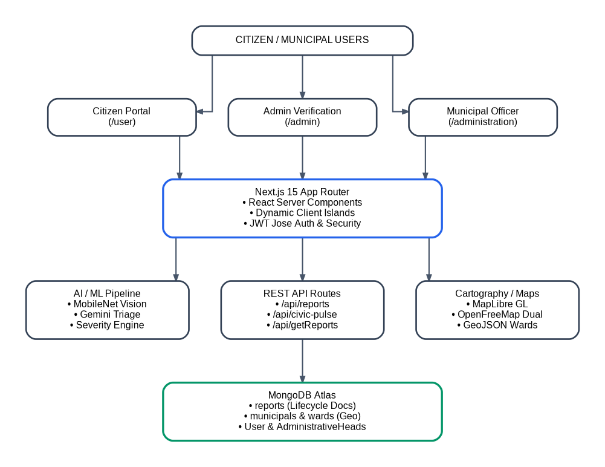

# Civic साथी — Where Your Voice Meets Actions

<div align="center">


### *Empowering Citizens. Streamlining Municipalities. Accelerating Action.*

[](https://nextjs.org/)
[](https://react.dev/)
[](https://tailwindcss.com/)
[](https://www.mongodb.com/)
[](https://maplibre.org/)
[](./LICENSE)

[](https://github.com/valiantProgrammer/Civic-Issues)

</div>

---

## 📖 Table of Contents

- [Overview](#-overview)
- [System Architecture](#-system-architecture)
- [Key Features](#-key-features)
- [Current UI Layouts & Screenshots](#-current-ui-layouts--screenshots)
  - [1. Landing Page & Community Discovery](#1-landing-page--community-discovery)
  - [2. Civic Pulse City-Wide Live Analytics](#2-civic-pulse-city-wide-live-analytics)
  - [3. Citizen Portal Dashboard (Dual Theme)](#3-citizen-portal-dashboard-dual-theme)
  - [4. Interactive Report Submission & Geospatial Pinning](#4-interactive-report-submission--geospatial-pinning)
  - [5. Report Detail & 6-Milestone Tracking](#5-report-detail--6-milestone-tracking)
  - [6. Citizen Help & Support Center (Dual Theme)](#6-citizen-help--support-center-dual-theme)
  - [7. Scoped Notification Center & Profile Management](#7-scoped-notification-center--profile-management)
  - [8. Administration & Municipal Command Center](#8-administration--municipal-command-center)
- [Realistic Municipal Grievance Lifecycle](#-realistic-municipal-grievance-lifecycle)
- [Tech Stack](#-tech-stack)
- [Project Directory Structure](#-project-directory-structure)
- [API Endpoints](#-api-endpoints)
- [Installation & Quick Start](#-installation--quick-start)
- [Development Team](#-development-team)
- [License](#-license)

---

## 🌟 Overview

**Civic साथी** is a full-stack, enterprise-grade public grievance redressal and municipal issue management platform modeled after standards from India's **CPGRAMS** and the **Ministry of Housing and Urban Affairs (MoHUA)**. 

The platform bridges the gap between urban citizens and municipal bodies (Municipal Corporations, Boroughs, and Ward Councils) through:
- **Instant Citizen Reporting**: Multilingual reporting with automated reverse-geocoding, ward detection, and media evidence.
- **AI-Powered Triage**: Real-time category validation, MobileNet visual classification, severity prediction, and automated duplicate detection.
- **End-to-End State Machine**: A 22-stage lifecycle spanning submission, departmental routing, field inspection, rework loops, SLA breach alarms, and citizen feedback/appeal.
- **Civic Pulse**: A 100% database-driven analytics engine visualizing city-wide trends, resolution velocity, and ward loads.
- **Sleek Dual Theme Design**: Bespoke light and dark modes powered by custom vector cartography styles (`ofm_light.json` and `ofm_dark.json`).

---

## 🏗️ System Architecture

<div align="center">
  
  <p><i>Figure: High-level System Architecture — Client Portals, Next.js 15 Server Layer, AI/ML Pipeline, and Geospatial Database.</i></p>
</div>

---

## ⚡ Key Features

- **🌐 Live Civic Pulse Analytics**: Zero mock data. Aggregates monthly resolution velocity, SLA compliance, issue categories, and ward-level distributions directly from MongoDB.
- **🗺️ Dual Theme Vector Cartography**: Dynamic vector rendering with MapLibre GL supporting instant toggle between daytime and nighttime city styles.
- **📍 Precise Geospatial Routing**: Automated polygon intersection (`$geoIntersects` / `$near`) routing complaints to exact municipal ward engineers.
- **⏳ 6-Node Visual Stepper Timeline**: Citizen tracking card showing `Submitted ➔ Verified ➔ Administration Review ➔ Assigned ➔ In Progress ➔ Completed` with audit timestamps.
- **🔄 Scoped 3-Button Control**: Toggles between `Track`, `Help`, and `Notification` views on the left column while preserving the right summary card and map preview intact.
- **⏱️ SLA & Escalation Engine**: Automated monitoring tracking target resolution hours (e.g. 48h), alerting supervisors upon SLA breach.
- **🔒 Role-Based Access Control**: Separate secure portals for Citizens, Review Admins, and Municipal Executive Engineers with signed JWTs.
- **📬 Comprehensive Email Pipeline**: Automated confirmation, status change, and assignment notifications dispatched via Nodemailer.

---

## 📸 Current UI Layouts & Screenshots

### 1. Landing Page & Community Discovery

The landing page welcomes citizens with live city statistics, an interactive vector map showing real-time issue pins, an intuitive 4-step workflow, and a filterable community issue feed.

<div align="center">
  
  <p><i>Figure 1: Landing Page Hero with dynamic issue counters, interactive vector map preview, and quick reporting CTA.</i></p>
</div>

<br />

| How Civic साथी Works | Community Issues Feed & Filter Chips |
| :---: | :---: |
|  |  |
| *01 Report, 02 Verify, 03 Resolve, 04 Improve* | *Community issue feed with category pills and live status tags* |

<br />

<div align="center">
  
  <p><i>Figure 2: Civic साथी Core Mission — Tailored interfaces for Citizens, Ward Admins, and Municipal Leadership.</i></p>
</div>

---

### 2. Civic Pulse City-Wide Live Analytics

A 100% database-driven public transparency dashboard directly computing city-wide resolution velocities, time-based complaint curves, category proportions, and ward loads directly from MongoDB Atlas.

<div align="center">
  
  <p><i>Figure 3: Civic Pulse high-level KPIs, smooth Reports Over Time area graph, and Issues by Category donut chart.</i></p>
</div>

<br />

<div align="center">
  
  <p><i>Figure 4: Ward-wise Complaint Distribution bar chart and Lifecycle Status breakdown.</i></p>
</div>

---

### 3. Citizen Portal Dashboard (Dual Theme)

The personalized Citizen Portal displays grievance volume badges, active tickets, recent submissions, and a live geospatial mini-map — rendered in both daytime and nighttime themes.

| Light Mode Dashboard | Dark Mode Dashboard |
| :---: | :---: |
|  |  |
| *High-clarity daytime dashboard with recent issues* | *Sleek dark theme optimized for low-light environments* |

---

### 4. Interactive Report Submission & Geospatial Pinning

Citizen reporting features automated location detection, reverse geocoding, and an interactive 3D vector map with custom crosshairs for pinpointing exact road, drainage, or garbage issue coordinates.

| Step 3: Location Pinning (Light Mode) | Step 3: Location Pinning (Dark Mode) |
| :---: | :---: |
|  |  |
| *Interactive vector cartography with auto ward detection* | *Nighttime dark vector map with high-contrast pin* |

<br />

<div align="center">
  
  <p><i>Figure 5: Step-by-step issue intake wizard ensuring comprehensive evidence collection.</i></p>
</div>

---

### 5. Report Detail & 6-Milestone Tracking

A two-column layout: The left column features a 6-node visual stepper timeline with milestone timestamps and audit trail, while the right column remains fixed with evidence photos, ticket ID, and interactive location mini-map.

| Light Mode Tracking Timeline | Dark Mode Tracking Timeline |
| :---: | :---: |
|  |  |
| *Submitted ➔ Verified ➔ Admin Review ➔ Assigned ➔ In Progress ➔ Completed* | *High-contrast stepper with audit timestamps and persistent ticket summary* |

---

### 6. Citizen Help & Support Center (Dual Theme)

An integrated support hub with keyword search, interactive FAQs categorized by domain, and direct municipal escalation contacts.

| Light Theme Help & Support | Dark Theme Help & Support |
| :---: | :---: |
|  |  |
| *Clean searchable FAQs and grievance escalation guidelines* | *Dark-mode tailored knowledge base and direct assistance* |

---

### 7. Scoped Notification Center & Profile Management

Citizens can seamlessly swap the left column view to inspect their real-time notification feed or update their municipal ward preferences without leaving the dashboard context.

| Scoped Notification Center (Light & Dark) | Citizen Profile & Ward Settings (Light & Dark) |
| :---: | :---: |
|   |   |
| *Real-time status updates and department notifications* | *Citizen contact information and registered municipal wards* |

---

### 8. Administration & Municipal Command Center

Comprehensive municipal portal designed for Junior Engineers, Executive Engineers, and Review Administrators to triage incoming reports, inspect evidence, audit SLAs, and assign repair teams.

<div align="center">
  
  <p><i>Figure 6: Municipal Command Center with real-time intake analytics, SLA breach alerts, and resolution metrics.</i></p>
</div>

<br />

| Grievance Triage & Verification Table | Investigation, Proof & Assignment Action |
| :---: | :---: |
|  |  |
| *Search, ward filters, severity badges, and status management* | *Field inspection verification, contractor assignment, and SLA auditing* |

---

## 🔄 Realistic Municipal Grievance Lifecycle

Civic साथी implements a realistic public grievance state machine:

<div align="center">
  
  <p><i>Figure 7: Complete 22-stage end-to-end Municipal Grievance Redressal lifecycle diagram.</i></p>
</div>

### Full State Definitions

| Status | Phase | Description |
| :--- | :--- | :--- |
| `submitted` | Intake | Initial complaint logged; ticket generated. |
| `acknowledged` | Intake | Citizen receipt acknowledged via email/SMS. |
| `triaged` | Intake | Automated severity check, AI image relevance, duplicate check. |
| `under_review` | Verification | Municipal grievance officer reviews complaint details. |
| `needs_information` | Verification | Clarification or closer photograph requested from citizen. |
| `accepted` | Verification | Municipal corporation confirms territorial & legal jurisdiction. |
| `rejected` | Terminal | Formally declined with explicit statutory/factual reason. |
| `duplicate` | Merge | Linked to primary ticket; citizen tracks master progress. |
| `assigned` | Operations | Dispatched to specific department (PWD, Electrical, Drainage, SWM). |
| `inspection` | Field | Junior Engineer / Sanitary Inspector conducts on-site survey. |
| `action_planned` | Field | Materials allocated, contractor scheduled, target timeline set. |
| `in_progress` | Field | Repair crew on site; machinery operating. |
| `on_hold` | Exception | Awaiting traffic police clearance, utility shutdown, or weather window. |
| `escalated` | Exception | SLA breached (>48h) or high-severity safety risk escalated to Commissioner. |
| `resolution_submitted` | Verification | Field team completes physical work and submits proof photographs. |
| `verification` | Verification | Assistant Engineer / Supervisor inspects site quality. |
| `rework_required` | Loop | Quality audit rejected patch/work; returned to field crew. |
| `resolved` | Resolution | Work certified as compliant; citizen formally notified. |
| `reopened` | Appeal | Citizen marks resolution unsatisfied; re-enters inspection loop. |
| `appeal_requested` | Appeal | Formal appellate review filed to Municipal Secretary. |
| `closed` | Final | Satisfied citizen feedback received; case formally archived. |

---

## 💻 Tech Stack

### Frontend Architecture
- **Framework**: [Next.js 15.5](https://nextjs.org/) (React 19, Server Components & App Router)
- **Styling**: [Tailwind CSS v4.0](https://tailwindcss.com/) with custom `@variant dark` tokens
- **Vector Maps**: [MapLibre GL](https://maplibre.org/) with OpenFreeMap vector styles
- **Icons**: React Icons (FontAwesome, Remix Icons, Lucide)
- **Notifications**: `react-hot-toast`

### Backend & Database
- **Runtime**: Node.js v20+ with ES Module support
- **Database**: [MongoDB Atlas](https://www.mongodb.com/) via Mongoose 8.x
- **Authentication**: Stateless signed JWTs with `jose` (HS256) & PBKDF2 password hashing
- **Mailing Engine**: [Nodemailer](https://nodemailer.com/) with HTML templates

### AI & Computer Vision
- **Vision Model**: MobileNet for client-side civic evidence classification
- **LLM Engine**: Google Gemini API for severity estimation & auto-triage

---

## 📂 Project Directory Structure

```
civicSaathi/
├── app/
│   ├── administration/            # Municipal Executive & Engineering portal
│   │   └── components/            # Analytics, grievance table, assignment views
│   ├── admin/                     # Manual verification portal
│   │   └── components/            # Review dashboards and municipality registration
│   ├── api/                       # Next.js Serverless API endpoints
│   │   ├── admi-reports/          # Administrative report queries & updates
│   │   ├── admin/                 # Admin diagnostics & ticket ID helpers
│   │   ├── civic-pulse/           # Live database analytics calculation engine
│   │   ├── getReports/            # Authenticated citizen report queries
│   │   ├── reports/               # Grievance creation, lookup & update
│   │   ├── seed/                  # Database seeder endpoint
│   │   └── user-Signin/           # Citizen auth endpoints
│   ├── components/                # Shared UI (Header, Hero, CivicPulseSection, Footer)
│   ├── context/                   # ThemeContext (Dual Theme state manager)
│   ├── user/                      # Citizen dashboard & issue tracker
│   │   └── components/components/ # ReportDetailCard, UserReportHistory, HelpCard
│   ├── layout.js                  # Root application layout
│   └── page.js                    # Landing page
├── lib/
│   ├── api.js                     # Unified frontend HTTP client
│   ├── auth.js                    # JWT creation, verification & PBKDF2 hashing
│   ├── db.js                      # Multi-tenant Mongoose connection pool
│   ├── emailService.js            # Automated status notifications
│   └── seedData.js                # Database seeder for municipal wards & reports
├── models/
│   ├── Administrative.js          # Municipal authority & officer schema
│   ├── Admin.js                   # Verification admin schema
│   ├── Municipalities.js          # Municipal Corporation schema
│   ├── Report.js                  # Comprehensive 22-state Grievance schema
│   ├── User.js                    # Citizen account schema
│   └── Ward.js                    # GeoJSON Ward geometry schema
├── public/
│   ├── images/                    # Core brand assets & thumbnails
│   │   └── screenshots/           # High-resolution UI showcase images
│   ├── ofm_dark.json              # OpenFreeMap dark vector style
│   └── ofm_light.json             # OpenFreeMap light vector style
├── .env                           # Environment configuration
└── package.json                   # Dependencies & scripts
```

---

## 🔌 API Endpoints

### 1. Civic Pulse Analytics
- `GET /api/civic-pulse?timeframe={Last 30 Days|Last 3 Months|Last 6 Months|This Year}`
  - Returns real-time aggregates: `totalReports`, `resolvedCount`, `resolutionRate`, `avgResolutionTime`, `linePoints`, `categoryData`, `wardData`, and `statusData`.

### 2. Citizen Reports
- `GET /api/getReports` or `POST /api/getReports`
  - Fetches grievances filed by the authenticated citizen (Bearer token).
- `POST /api/reports`
  - Creates a new report; triggers reverse geocoding, ward auto-detection, authority assignment, ticket ID generation, and email dispatch.
- `PUT /api/reports/[id]`
  - Citizen report update and re-submission endpoint.

### 3. Municipal Workflow Operations
- `PUT /api/admi-reports/[id]`
  - Advances report through grievance lifecycle (`accepted`, `assigned`, `inspection`, `in_progress`, `on_hold`, `resolved`, `rework_required`, `rejected`, `closed`).
  - Appends audit history entry: `{ action, actorName, actorRole, timestamp, notes }`.
  - Recalculates SLA compliance and dispatches status update emails.

### 4. Database Seeder
- `GET /api/seed?force=true`
  - Idempotently populates MongoDB with Kolkata Municipal Corporation, 12 geospatial wards, municipal officers, and 25 realistic grievance reports.

---

## 🚀 Installation & Quick Start

### 1. Prerequisites
- **Node.js**: v18.17+ or v20+
- **MongoDB**: MongoDB Atlas URI or local instance (v6.0+)
- **Git**

### 2. Clone & Install
```bash
git clone https://github.com/valiantProgrammer/Civic-Issues.git
cd Civic-Issues
npm install
```

### 3. Environment Variables
Create a `.env` file in the project root:
```env
# Application
NEXT_PUBLIC_API_BASE_URL=http://localhost:3000/
JWT_SECRET=your-random-32-char-secret-key-here
ACCESS_TOKEN_EXPIRY=3d
REFRESH_TOKEN_EXPIRY=30d

# MongoDB Connection
MONGODB_URI=mongodb+srv://<user>:<password>@cluster0.mongodb.net/

# Email Notifications (Gmail / SMTP)
SMTP_USERNAME=your.email@gmail.com
SMTP_PASSWORD=your-app-password
EMAIL_FROM=Civic Saathi <noreply@civicsaathi.gov.in>

# Cloudinary (Optional image hosting)
CLOUDINARY_CLOUD_NAME=your_cloud_name
CLOUDINARY_API_KEY=your_api_key
CLOUDINARY_API_SECRET=your_api_secret

# AI Triage
GEMINI_API_KEY=your_gemini_api_key
```

### 4. Seed the Database
Populate the database with municipal wards, administrative officers, and realistic grievance data:
```bash
# Seed via curl or browser
curl http://localhost:3000/api/seed?force=true
```

### 5. Launch Development Server
```bash
npm run dev
```
Open **[http://localhost:3000](http://localhost:3000)** in your browser.

---

## 👥 Development Team

Developed with dedication to transparent civic governance:

- [**RUPAYAN DEY**](https://github.com/valiantProgrammer) — Full Stack Lead & Architecture
- [**RISHIKA MUKHERJEE**](https://github.com/bitsByRishika/) — UI/UX Design & Frontend Engineering
- [**RITAM PAUL**](https://github.com/ritampaul192/) — Backend Services & Database Architect
- [**SOMMIDHYA BISWAS**](https://github.com/Somiddhya09/) — QA Testing, Admin Portal & Documentation

---

## 📄 License

This project is open-source and released under the **[MIT License](./LICENSE)**.

<div align="center">
  <sub>Built with ❤️ for cleaner, safer, and stronger communities.</sub>
</div>
